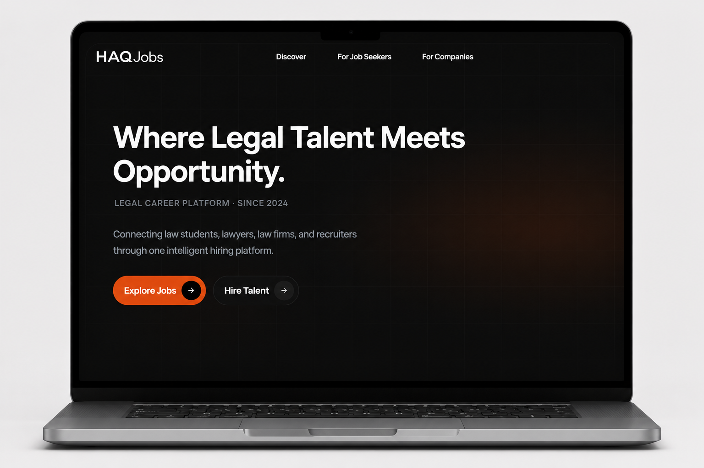
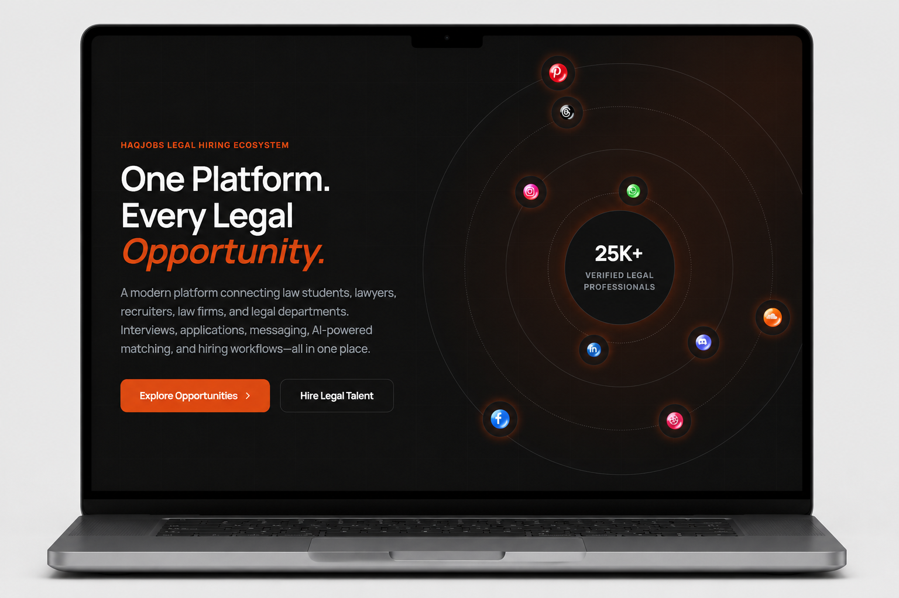
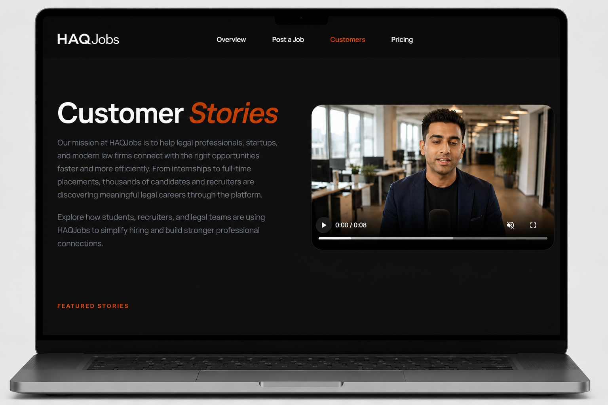
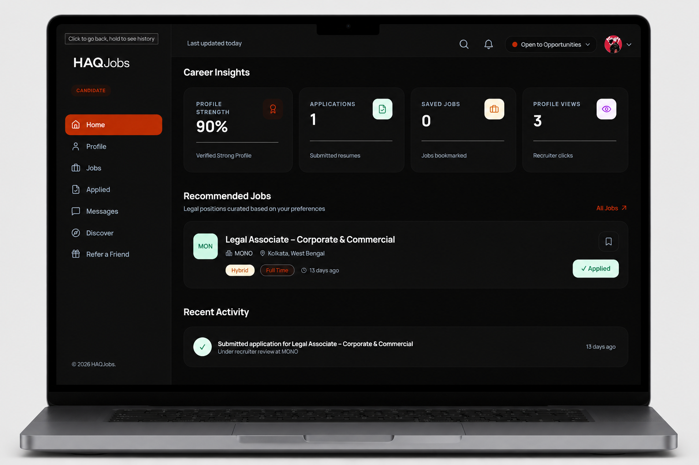
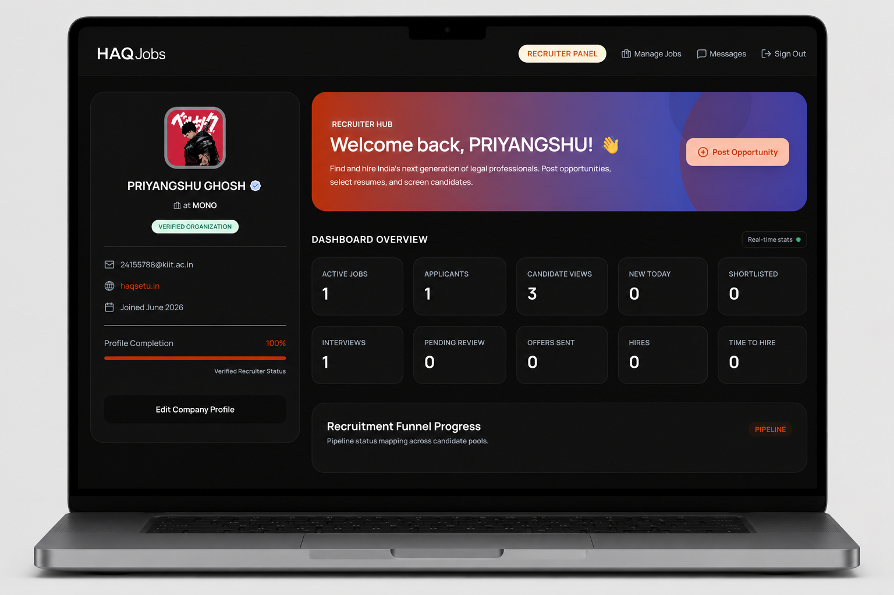
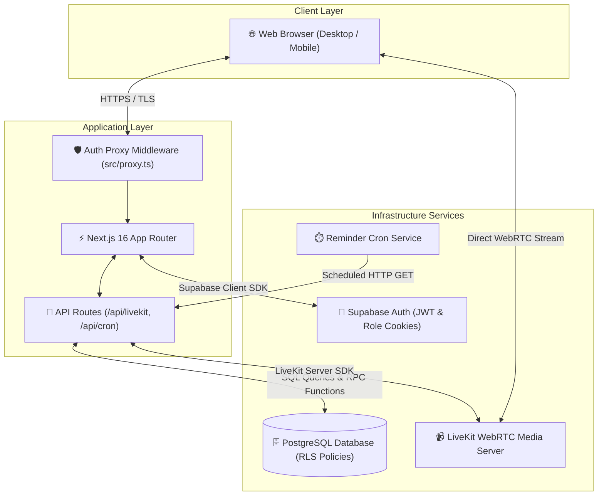

<div align="center">

# HAQJobs

### Next-Generation LegalTech Recruitment & Video Interviewing Platform

*Connecting top legal talent with premier law firms, corporate legal teams, and LegalTech innovators.*

<br />

[](https://nextjs.org)
[](https://www.typescriptlang.org)
[](https://supabase.com)
[](https://livekit.io)
[](https://tailwindcss.com)
[](LICENSE)

<br />

<p align="center">
  <a href="https://haqjobs.com"><strong>Explore Live Demo »</strong></a>
  &nbsp;•&nbsp;
  <a href="#-quick-start--installation"><strong>Documentation</strong></a>
  &nbsp;•&nbsp;
  <a href="https://github.com/drannonymousxx/haq_jobs/issues/new"><strong>Report Issue</strong></a>
  &nbsp;•&nbsp;
  <a href="https://github.com/drannonymousxx/haq_jobs/issues/new"><strong>Feature Request</strong></a>
</p>

<br />

</div>

---

## 🖼️ Hero Preview

<div align="center">
  
</div>

<br />

---

## ⚖️ About HAQJobs

### What is HAQJobs?

**HAQJobs** is a specialized LegalTech recruitment and talent acquisition platform designed specifically for the legal ecosystem. Built on Next.js 16, Supabase, and LiveKit, HAQJobs bridges the gap between legal professionals (lawyers, advocates, legal counsel, and law interns) and hiring entities (law firms, corporate legal departments, and LegalTech companies).

### Why HAQJobs Exists & The Problems It Solves

Legal recruitment is uniquely complex:
- **Generic job portals lack legal nuance**: Generic hiring platforms fail to evaluate legal-specific criteria such as Post-Qualification Experience (PQE), Bar Council admissions, practice area specialization (e.g., Corporate M&A, Intellectual Property, White-Collar Crime), and court practice records.
- **Fragmented hiring pipelines**: Recruiters rely on external video call links, manual email threads, and disconnected tracking spreadsheets.
- **Opaque application tracking**: Candidates submit applications into opaque portals with no visibility into review status, shortlisting, or interview scheduling.

HAQJobs solves these challenges by providing a unified, role-based workspace with practice-area search filters, real-time application status tracking, integrated WebRTC video interviewing, and candidate referral tracking.

### Value for Candidates & Recruiters

- **For Candidates**: Build a structured legal profile, discover practice-specific roles, track application status transparently across stages (Applied → Shortlisted → Interviewing → Offered → Hired), participate in embedded HD virtual interviews, and invite peers via a referral program.
- **For Recruiters & Law Firms**: Post practice-targeted openings, manage candidates through an interactive applicant tracking pipeline, schedule and host virtual video interviews via LiveKit, send binding job offers, and access candidate search tools.

---

## 📸 Product Interface

<table align="center" width="100%">
  <tr>
    <td width="50%" align="center">
      <strong>Landing Page & Discovery</strong>
      <br /><br />
      
    </td>
    <td width="50%" align="center">
      <strong>Legal Job Search & Openings</strong>
      <br /><br />
      
    </td>
  </tr>
  <tr>
    <td width="50%" align="center">
      <br />
      <strong>Candidate Portal & Tracking Dashboard</strong>
      <br /><br />
      
    </td>
    <td width="50%" align="center">
      <br />
      <strong>Recruiter Workspace & Applicant Pipeline</strong>
      <br /><br />
      
    </td>
  </tr>
</table>

<br />

---

## ✨ Key Features

| Feature Component | Implementation Status & Key Capabilities |
| :--- | :--- |
| **Candidate Dashboard** | Unified portal (`/dashboard`) tracking active job applications, status updates, interview schedules, saved jobs, and profile statistics. |
| **Recruiter Dashboard** | Applicant tracking pipeline (`/dashboard/recruiter`) to manage applicants across stages (Applied → Shortlisted → Interviewing → Offered → Hired). |
| **Job Listings & Search** | Full-text job search filtering by practice area (Corporate Law, Litigation, IP, Tax, Banking), work mode (Remote/Hybrid/Onsite), and location. |
| **Internship Portal** | Specialized track for law students, fresh graduates, and junior advocates seeking legal internships and mini-pupillages. |
| **LiveKit Video Interviews** | WebRTC-powered virtual interview rooms (`/interview/[id]`) with automated room token generation (`/api/livekit/token`) and room management. |
| **Authentication & RLS** | Supabase Auth with server-side cookie proxy middleware (`src/proxy.ts`) enforcing role isolation and Row Level Security (RLS). |
| **Referral System** | Candidate referral link generation (`/dashboard/refer`), shareable via WhatsApp/LinkedIn with tracking of converted invites. |
| **Profile Management** | Granular legal profile builder supporting experiences, bar admission details, educational history, skill badges, and recruiter company profiles. |
| **Responsive Glassmorphism UI** | Designed with Tailwind CSS v4 and Framer Motion micro-animations, responsive across mobile, tablet, and desktop viewports. |
| **Automated Reminders & Alerts** | Backend cron API (`/api/cron/reminders`) sending automated interview reminders and status notifications. |

<br />

---

## 🛠 Tech Stack

| Domain | Technology | Usage in Repository |
| :--- | :--- | :--- |
| **Framework** |  | Next.js 16 App Router, Server Actions, & Middleware Proxy |
| **Language** |  | Type safety across application, schemas, and API handlers |
| **UI Library** |  | React 19 server components and interactive client state |
| **Styling** |  | Modern styling engine with PostCSS integration |
| **Animations** |  | Gesture controls, page transitions, and glassmorphic cards |
| **Database & Auth** |  | PostgreSQL database, JWT authentication, and RLS security |
| **Video Engine** |  | Real-time WebRTC Video SDK (`@livekit/components-react`) |
| **Icons** |  | Lightweight vector icon suite |

<br />

---

## 🏗 System Architecture



<br />

---

## 📂 Project Structure

```text
haq_jobs/
├── assets/
│   └── readme/                 # Verified README screenshots & hero banner
├── public/                     # Static media, icons, and public assets
├── src/
│   ├── app/                    # Next.js App Router pages & API routes
│   │   ├── api/                # Backend API routes (cron reminders, LiveKit tokens)
│   │   ├── auth/               # Auth callbacks and OAuth handlers
│   │   ├── candidate/          # Candidate profiles (`/candidate/[id]`)
│   │   ├── customers/          # Customer & company listing directory
│   │   ├── dashboard/          # Role-based dashboards
│   │   │   ├── (candidate)/    # Candidate dashboard, applied jobs, refer page
│   │   │   └── recruiter/      # Recruiter workspace, candidate search, job poster
│   │   ├── discover/           # Legal opportunity discovery portal
│   │   ├── for-companies/      # Enterprise recruiter onboarding page
│   │   ├── interview/          # LiveKit virtual interview room (`/interview/[id]`)
│   │   ├── job-seekers/        # Candidate marketing page
│   │   ├── login/              # Unified login page
│   │   ├── post-job/           # Recruiter job submission form
│   │   ├── pricing/            # Subscription & pricing plans
│   │   └── signup/             # Role selection & registration flows
│   ├── components/             # Reusable UI component library
│   │   ├── candidate/          # Profile builders & experience timeline forms
│   │   ├── common/             # Modals, inputs, buttons, and navigation elements
│   │   ├── home/               # Hero sections, feature highlights, Spline components
│   │   └── layout/             # Responsive headers, footers, and sidebars
│   ├── lib/                    # Supabase client & authentication utilities (`src/lib/auth.ts`)
│   ├── proxy.ts                # Server-side cookie & role authentication proxy middleware
│   ├── styles/                 # Global styling rules and CSS modules
│   └── types/                  # Shared TypeScript interfaces & database definitions
├── database/
│   └── migrations/             # PostgreSQL schemas & SQL migration scripts
├── scripts/                    # Automated testing and E2E workflow scripts
├── LICENSE                     # MIT Open Source License
├── .env.example                # Template for environment configuration
└── package.json                # Project dependencies and script declarations
```

<br />

---

## ⚡ Quick Start & Installation

### Prerequisites

- **Node.js**: `v20.0.0` or higher
- **npm**: `v9.0.0` or higher
- **Supabase Account**: PostgreSQL database & authentication project
- **LiveKit Cloud Account**: WebRTC server credentials

### Setup Steps

1. **Clone the repository**:
   ```bash
   git clone https://github.com/drannonymousxx/haq_jobs.git
   cd haq_jobs
   ```

2. **Install project dependencies**:
   ```bash
   npm install
   ```

3. **Configure Environment Variables**:
   ```bash
   cp .env.example .env.local
   ```
   *Edit `.env.local` and fill in your Supabase and LiveKit credentials.*

4. **Run SQL Database Migrations**:
   Execute the migration SQL scripts located in `database/migrations/` in your Supabase SQL Editor in the following order:
   - `database/migrations/candidate_profile_schema.sql`
   - `database/migrations/migration_candidate_search.sql`
   - `database/migrations/migration_interview_livekit.sql`
   - `database/migrations/migration_missing_tables.sql`

5. **Launch Development Server**:
   ```bash
   npm run dev
   ```
   Open [http://localhost:3000](http://localhost:3000) in your browser.

<br />

---

## 🔑 Environment Variables

The application relies on the following environment variables. Ensure `.env.local` contains valid credentials:

| Variable Name | Required | Scope | Description |
| :--- | :--- | :--- | :--- |
| `NEXT_PUBLIC_SUPABASE_URL` | Yes | Public / Client | Supabase Project HTTP URL |
| `NEXT_PUBLIC_SUPABASE_ANON_KEY` | Yes | Public / Client | Supabase Public Anonymous API Key |
| `SUPABASE_SERVICE_ROLE_KEY` | Optional | Server / Secret | Admin key for automated cron service execution |
| `NEXT_PUBLIC_SITE_URL` | Yes | Public / Client | Base application domain URL for OAuth redirects |
| `NEXT_PUBLIC_APP_URL` | Optional | Public / Client | Base URL for generated interview links |
| `LIVEKIT_URL` | Yes | Server / Client | LiveKit WebRTC Cloud server WebSocket URL |
| `LIVEKIT_API_KEY` | Yes | Server / Secret | LiveKit API Key for token authorization |
| `LIVEKIT_API_SECRET` | Yes | Server / Secret | LiveKit Secret Key for signing JWT tokens |
| `TEST_EMAIL` | Optional | Local / Test | Test account email for verification scripts |
| `TEST_PASSWORD` | Optional | Local / Test | Test account password for verification scripts |

<br />

---

## 🗺 Roadmap

- [x] **Phase 1: Core Legal Hiring Engine (Completed)**
  - [x] Dual-role authentication flow (Candidate & Recruiter) via Supabase Auth
  - [x] Middleware proxy for session handling & role route protection (`src/proxy.ts`)
  - [x] Granular legal candidate profile builder & skill management
  - [x] Recruiter job posting and full-text job search with practice area filters
  - [x] Interactive applicant tracking pipeline (Applied → Shortlisted → Interviewing → Offered → Hired)

- [/] **Phase 2: Virtual Interviewing & Engagement (In Progress)**
  - [x] Embedded LiveKit WebRTC video interview rooms (`/interview/[id]`)
  - [x] Server-side LiveKit JWT room token generator (`/api/livekit/token`)
  - [x] Candidate referral system with shareable tracking links (`/dashboard/refer`)
  - [/] Real-time candidate-recruiter messaging workspace (`/dashboard/messages`)
  - [x] Automated email reminder cron service (`/api/cron/reminders`)

- [ ] **Phase 3: Intelligence & Enterprise Support (Planned)**
  - [ ] AI-assisted resume parsing and legal experience extractor
  - [ ] Candidate match score evaluation based on bar PQE and court specializations
  - [ ] Multi-tenant law firm workspace management for enterprise partners

<br />

---

## 👨‍💻 Creator

Built and maintained by **Priyangshu Ghosh**.

HAQJobs is an independent LegalTech initiative focused on modernizing legal recruitment through intuitive product design, AI-powered workflows, and scalable web technologies.

---

<br />

## 🤝 Contributing

Contributions are welcomed. To contribute to HAQJobs:

1. **Fork the Repository**
2. **Create a Feature Branch**:
   ```bash
   git checkout -b feature/amazing-feature
   ```
3. **Commit your changes**:
   ```bash
   git commit -m "feat: add amazing feature"
   ```
4. **Push to the branch**:
   ```bash
   git push origin feature/amazing-feature
   ```
5. **Open a Pull Request** describing your additions.

<br />

---

## 📜 License

Distributed under the **MIT License**. See [`LICENSE`](LICENSE) for details.

<br />

---

<div align="center">

────────────────────────

Made with ❤️ by **Priyangshu Ghosh**

Founder & Developer of HAQJobs

Building modern LegalTech products that simplify legal hiring through thoughtful design, scalable engineering, and AI-powered workflows.

────────────────────────

</div>
